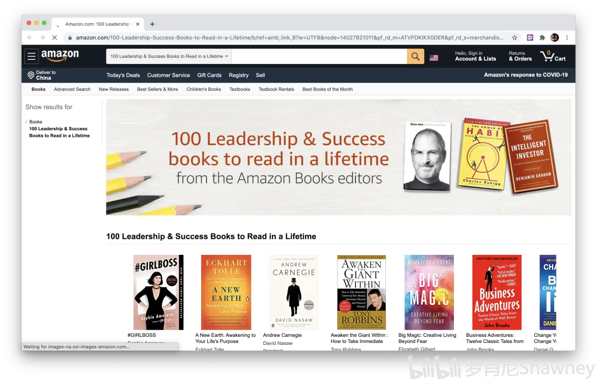
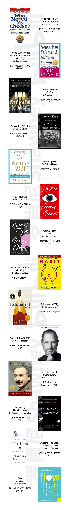

# 【终极英文书单】闲书原著推荐——从入门到进阶

大家千呼万唤的书单总算出炉啦！

这篇专栏基于肖尼的第一个视频——语言习得输入假说，没有看过的小伙伴一定记得先看后找书。

[↓↓↓](https://www.bilibili.com/video/BV1aD4y127GE)  
  

18:11

【高能干货】这个视频将会颠覆你对英语学习的认知——总述·阅读篇

137.9万 3903

视频 罗肖尼Shawney

  
  
[↑↑↑](https://www.bilibili.com/video/BV1aD4y127GE)

此外，我在川大的学长向杨Alan多年从事以原著为基础的语言教育，他特意为B站的大家制作了一份从零到高阶的书单，我自己这篇专栏也参考了他的选择。可以将两篇专栏结合在一起，找到最适合自己的读物。  

[↓↓↓](https://www.bilibili.com/read/cv7606850?from=articleDetail)  
  

英文原版精读清单 | From Zero to Hero进阶路线图

不少小伙伴咨询英文原版书的清单，希望能从简单的读物开始日拱一卒，实现高质量的可理解阅读输入。我列出了这些年教学过程中的原版书，按照初中高阶的顺序，从词汇量1500基础就能进入的儿童读物逐步进阶到文史哲学术大部头。我特意将书按照路线图的方式展现，方便大家按照自己现有的语言水平切入。 对于成年人，原版精读也可以从儿童读物开始。为什么国人再怎么努力学英文，和地道表达还是隔着一层天花板？我有一个理论：大多数人并没有循序渐进地阅读英文儿童读物，而是一开始就接触比较成人化的读物

文章 向杨Alan... 7.3万 1143 19

  
  
[↑↑↑](https://www.bilibili.com/read/cv7606850?from=articleDetail)

**第一部分——阅读准备**

**1\. 首先几个重要的disclaimer：**  

*   这份书单仅仅是一个意向性的阅读建议，只有自己上手去寻找、阅读，才能找到难度合适、感兴趣的读本
    
*   书籍的选择无法满足每个人的偏好，Up主也无力针对个人进行推荐，但难度匹配、找书方法的原则适用于任何人
    
*   Up主本人没有下述书籍的资源，还请大家自行在网络上寻找或者购买
    

**2\. 什么是适合你的难度？**

要找到适合自己水平的书籍，蓝思值（Lexile Measure）将会是你最好的帮手。这是一个被广泛使用的分级阅读难度指数，范围为0L~2000L——数字越小则书籍的词汇、句法难度越低，数字越大则难度越高。专栏的前半部分书籍（儿童、入门级别为主）都包含了蓝思值，如果你有自己想读的书籍，也可以到hub.lexile.com/find-a-book/search搜索这本书的蓝思值。

与此同时，蓝思值Lexile Measure也是一个学生英文阅读能力的标尺。按照蓝思值官网的说明，**如果你可以理解一本英文原著75%左右的内容，那么你的阅读能力和这本书的蓝思值相同**。比如你可以读懂Charlie and the Chocolate Factory大约七成左右的内容，而这本书的蓝思值是810L，那么你的阅读等级也差不多就是810L。较为推荐的做法是**选择比自己的Lexile水平指数低100L到高50L (-100L ~ +50L) 的范围进行阅读**。比如你的水平是810L，那么选择710L到860L的书籍都是合适的——Up主认为，一本书只要你能读懂七八成内容，那就差不多算是“i+1”，没有必要太过于纠结。

下表是Up主在网上检索到的一个蓝思指数和中国学生阅读能力之间的对照关系，但是没有查到其出处，因此仅供参考。

蓝思分级和中国学生英文阅读能力关系表 (仅供参考)

因此选择水平相匹配的书籍有三步——第一步是根据自己的水平等级（比如高一），从上面的对照表里选择一个Lexile蓝思值级别（比如650L to 850L）；再从下面的推荐里找一两本这个范围的书（比如Charlie and the Chocolate Factory，810L），拿来读读看；最后，如果话题、难度适合自己，那就快乐地读下去，不适合，换下一本书、继续寻找。  

如果说Up主书单里的书不合胃口，那么请用同样的原则去发现自己的心头好。还是那句话，自己找来读一读，才知道是否适合自己！

**3\. 没有方法的阅读方法**

经验原则——**每读两页原著，最多查一个生词**。此外就顺畅地读下去就行了，就这么简单。这条经验来自伍君仪老师，主要目的是不因为查词而中断阅读体验——读完一本原著，比查一百个单词重要得多。二语习得论认为，语言习得的标志特征之一是“无意识”，真正的语汇习得是理解信息、全情投入时才会发生，而阅读者对习得过程通常是没有意识的。有很多证据表明，你越是花时间在所谓分析语法、刻意记忆、摘抄总结上，语言习得的效率会越低。

如果你选择的书符合“i+1”原则，那么按理说基本不翻词典你也能大致理解故事的内容。如果说一页有大量生词，那么说明难度过高、应当降级。读闲书、读闲书，以前你是怎么偷读漫画、偷读小说的，那么这里也一样——无所谓这个方法、那本词典。大部人适合“两页查一词”的原则，但如果你真的很喜欢语法、单词、句式，那么你遇词必查也可以，只要不影响流畅的阅读体验和速度，怎样都可以！

此外，千万不要选择双语读本——有研究显示，在母语辅助的任何情境下，几乎任何阅读、聆听的习得效率都会被降低到接近于零。

**4\. Narrow Reading 集中（狭窄）阅读**

作为入门阅读者，一段时间建议只读一个系列或一个作者，这称作Narrow Reading。基于这个原则，这个书单的拟定也是以系列为单位的。

Narrow Reading的好处有两个——第一是作者常用的词汇和语法会反复出现。如果连读一位作者的数本书，哪怕完全不做笔记，你也将无可避免地记住大量词汇；第二是系列作品有相似的语境，而借助语境可以精确习得语汇的含义和用法。这个过程与毫无背景信息的单词表相比有着天壤之别；第三是难度会自动递增，往往阅读完一整个系列的图书（比如Roald Dahl系列），你的语言能力也就上了一个台阶。

  

**第二部分——从0L到1000L**

**如果你完全零基础入门：**在Up主之前的专栏文章里有提到过，要进行基础的自由阅读，最基本的入门英语能力（国内小学1-3年级水平）仍然是需要的。这意味着至少可以阅读蓝思值100L to 200L之间的书籍，经验之谈就是具备至少1500左右的词汇量。如果说你暂时还不具备这个水平的词汇范围，那么建议你在读闲书之前，先用B站上的英语入门视频来做初步准备。当然从类似这样的幼儿书入门也并非不可能，只不过趣味性可能相对较低。

**如果你已经具备至少1500的词汇**：那么回顾之前的选书步骤——

1.  根据自己的年级估粗略估计一个蓝思值（比如高一，650L to 850L）
    
2.  找一本属于这个范围的书（比如Charlie and the Chocolate Factory，810L）来读读看
    
3.  难度适合、觉得有趣，那就快乐地读下去；否则换下一本书，直到找到心中所好为止
    

请注意：**蓝思值只是一个粗略参考，****对于同一个系列的读本，阅读顺序不用死板地根据蓝思值来递进**。比如Magic Tree House从第一册开始，蓝思值上下波动不断，但是从阅读体验上来说并没有太多的差异。一切以读得开心为重，不要太纠结一个指标啦！

那么，书单来袭！

  

**第三部分——自由自选阅读**  

如果你可以完成 700L~800L 等级及以上的阅读（大约读完了十几本故事书），或者你的阅读能力一开始就在这个级别，那么仅仅依靠Up主的个人推荐就不再现实，这有两点原因：第一是大量的nonfiction和面向成年读者的fiction不再有蓝思值数据，第二是我的个人偏好无法匹配大家自身的喜好和水平。就像视频里谈到的，初入门者需要首先在大量有趣的故事阅读里逐渐增进词汇、句法、语法的能力，而读了十来本原著的人，就应当已经有上外网择书的能力和自由了。因此，我将自己搜寻书籍的方法写在这里，授大家以渔。

**最好的找书方法之一就是看书单**。如果你有梯子可以翻墙，可以去国外最受欢迎的**荐书网站Goodreads.com**上面的**Listopia分区**，这里有你能想象到的所有书籍类别、所有年代、也有“有史以来最佳”这样的书单。点开所有书籍的页面之后，你可以看到大量读者的评分和评论，以决定自己是否想要阅读。

当然，如果你没有办法翻墙，还有一个绝佳的选书去处——**亚马逊美国区**。键入**amazon.com/books**，你就会来到同样全面而精彩的亚马逊书籍专区。你可以点进左边“100 Books to Read in a Lifetime”这样的书单，或者点击“Business & Investing”分区去找一本好的商业读物。

美亚评论区可谓是书籍的试金石。往往通过阅读顶部的几条评论，你就能大致判断这本书的质量和类型，并且我发现**阅读评论本身也是一种极佳的可理解输入**——可谓是一举两得了。

大多数畅销书在国内电商也可以买到正版，而如果这些书有Kindle版本，那么恭喜你：你应该可以在淘宝、闲鱼等平台找到“代购电子书”的商家帮你搞到这些书，这个问题在某乎之类的地方有很多的教程。

如果你只想从一堆经过时间检验的好书里选一选——

如果你喜欢科幻/奇幻——

如果你喜欢经济/商业——

这里是一小部分我曾经读过/了解过的书，其中更多的是nonfiction（非虚构类）。可以看到这些书籍的难度大多在蓝思值 900L 到 1200L 之间，其实已经和之前的一些故事书系列后期的作品持平了。也就是说，如果你可以较为轻松地读懂《纳尼亚传奇：狮子·女巫·魔衣橱》，那么英语世界中广大的有趣书籍，对你而言已经触手可及了。

如果你已经拥有了随心选择英文闲书的自由，那么恭喜你——英语对你来说将不再是需要学习的科目，而已经成为了你生活中最重要的工具之一。一个有着浩瀚信息和有趣文化的广阔世界，将在你的面前缓缓展开。

  

**结语**

请记住，**书要自己选****，而****可以随心选书阅读的自由，是建立在很多很多故事书的阅读基础之上的**。

没有一个人可以跳过故事阅读阶段，而直接去进行自由自选阅读，所以说——不要急于求成，享受你所读的每一本书，就是最好的进步方式。

而当你可以用英语来学习任何事物的那一天，什么语言考试都将变得简单而无聊。你的视野和可获取的资源将从此不再相同，你的人生或许也会因此而被改变。

Have fun and good luck!
